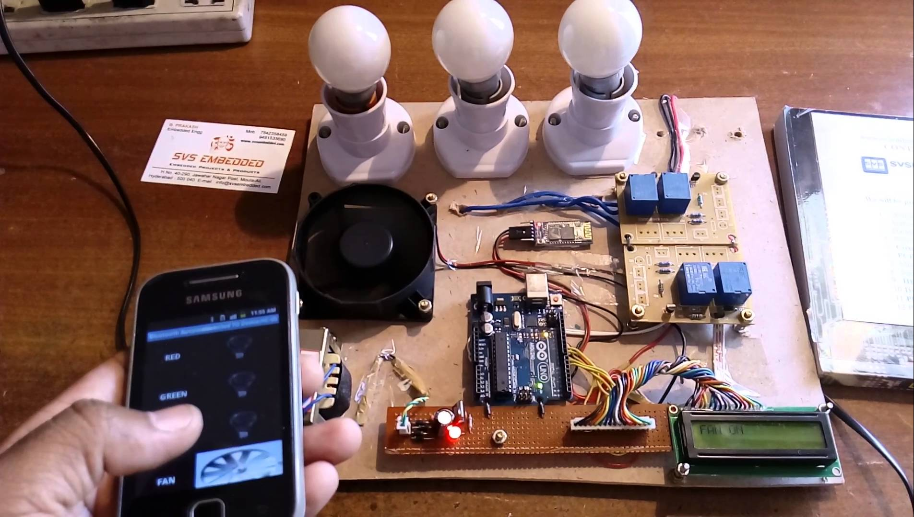
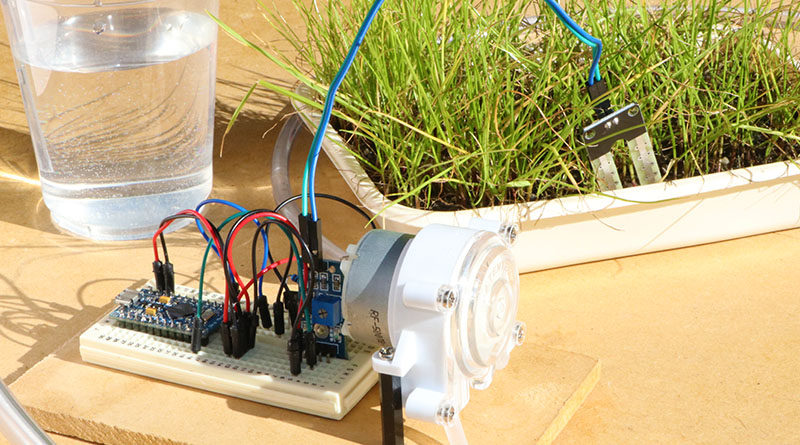
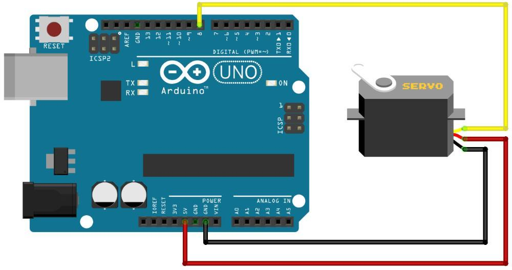

### Hardware Hacking an Arduino
#### Using Node.js


----

### Building a
#### Bug-O-Meter

----

### What is an Arduino?
* Open-source electronics platform <!-- .element: class="fragment" -->
* Reads inputs (sensors) <!-- .element: class="fragment" -->
* Controls outputs (lights, servos, ...) <!-- .element: class="fragment" -->
* ... and program them <!-- .element: class="fragment" -->

----


----

### Example projects

----

### Home automation



----

### Watering plants



----

### Autonomous driving


----

### Electrical circuit

----


----

### Program the device

* Connect via USB <!-- .element: class="fragment" -->
* Write a program (C/C++ - like) <!-- .element: class="fragment" -->
* Flashing it <!-- .element: class="fragment" -->

----

### Blinking a LED

```
void setup() {
  pinMode(13, OUTPUT);
}

void loop() {
  digitalWrite(13, HIGH);
  delay(1000);
  digitalWrite(13, LOW);
  delay(1000);
}
```

----

### But what about Node.js?

----

### Johhny-Five
* Robotics & IoT Platform <!-- .element: class="fragment" -->
* Support for Arduino, Raspberry Pi, Intel Galileo etc... <!-- .element: class="fragment" -->
* Control your device using JavaScript <!-- .element: class="fragment" -->

----

### But what about the Bug-O-Meter?

----

### The 'hard' part

----

### Connecting the LED


----

### Connecting the servo



----

### The 'soft' part
* Get the issues from Github <!-- .element: class="fragment" -->
* Show a loading indicator <!-- .element: class="fragment" -->
* Connect to the Arduino <!-- .element: class="fragment" -->
* Control the Bug-O-Meter (servo) <!-- .element: class="fragment" -->

----

### The 'creative' part
* Cutting the meter out of cardboard <!-- .element: class="fragment" -->
* Make holes for the LED and servo <!-- .element: class="fragment" -->
* Attach the needle to the servo <!-- .element: class="fragment" -->
* Create a legend for the meter <!-- .element: class="fragment" -->

----

### Demo time!
